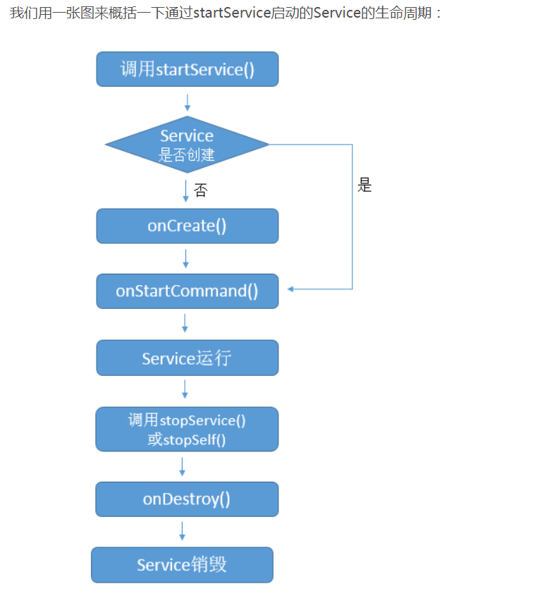
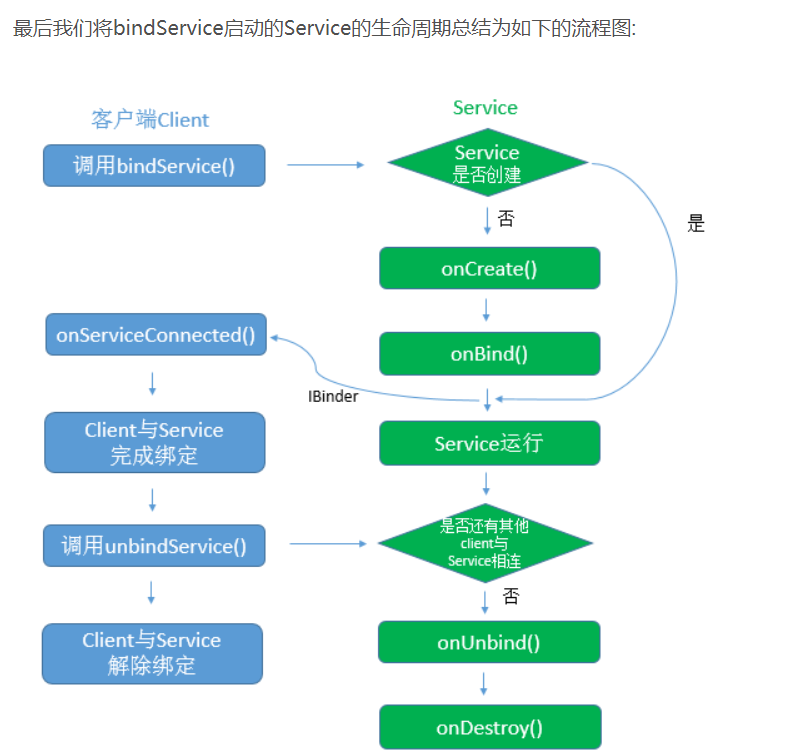

### Service 

Service是Android中实现程序后台运行的解决方案，它非常适合去执行那些不需要和用户交互而且还要求长期
运行的任务。服务的运行不依赖于任何用户界面，即使程序被切换到后台，或者用户打开了另外一个应用程序，
服务仍然能够保持正常运行。需要注意的是，服务并不是运行在独立的进程中，而是依赖于创建服务的应用程序
进程。挡某个应用程序被杀掉的时候，所有依赖于该进程的服务也会停止运行。另外，服务并不会自动开启线程，
所有的代码都是默认运行在主线程当中的。也就是说，我们需要在服务内部手动创建子线程，并在这里执行具体
的任务，否则就可能出现主线程被阻塞的情况。
* 停止一个服务可以使用Context的stopService或Service的stopSelf方法
* 绑定服务并不会调用Service的onStartCommand()方法





当Android面临内存匮乏的时候，可能会销毁掉你当前运行的Service，然后待内存充足的时候可以重新创建
Service，Service被Android系统强制销毁并再次重建的行为依赖于Service中`onStartCommand`方法的返回值。
我们常用的返回值有三种值，START_NOT_STICKY、START_STICKY和START_REDELIVER_INTENT，
这三个值都是Service中的静态常量。

* START_NOT_STICKY=2：如果Service运行的进程被杀死以后，Service不再处于启动状态并且不会重新创建Service，除非再次调用
`Context.startService(Intent)`方法。在什么时候适用这种返回值呢？在我们启动服务做一些工作，这个服务
在内存紧张时可以被停止。然后在晚些时候再次启动服务来进行工作。例如，我们可以启动一个服务来定时轮询服务器获取一些数据，当我们启动Service以后
可以在`onStartCommand`方法中使用定时器再次启动服务，达到定时轮询的功能。

* START_STICKY=1：如果Service运行的进程被杀死以后，Service会保留在启动状态，但是不会保留`intent`--就是Context.startService(Intent)传递过来的Intent。
随后系统会试着重新创建服务，因为Service处于运行状态，在新的服务实例创建以后，一定会调用`onStartCommand`方法，但这时在`onStartCommand`方法中获取不到
Intent信息。这个返回值适用场景：服务被确切的启动或者停止，并且不需要intent信息，例如后台播放音乐。

* START_REDELIVER_INTENT=3：如果Service运行的进程被杀死以后，系统会再次创建该Service,并执行onStartCommand回调方法，
Android系统会将Service在被杀掉之前最后一次传入onStartCommand方法中的Intent保留下来并传入到重新创建后的Service的onStartCommand方法中，
这样我们就能读取到intent参数。只要返回START_REDELIVER_INTENT，那么onStartCommand重的intent一定不是null。如果我们的Service需要
依赖具体的Intent才能运行（需要从Intent中读取相关数据信息等），并且在强制销毁后有必要重新创建运行，那么这样的Service就适合返回
START_REDELIVER_INTENT。

### IntentService 

自动在工作线性执行任务，执行完毕任务以后自动停止，内部使用Handler的方式处理用户发送的请求

使用方式 实现onHandleIntent方法，逻辑在这里进行处理

```java
public class MyIntentService extends IntentService {
    private static final String TAG = "MyIntentService";

    public MyIntentService() {
        super("MyIntentService");
    }

    @Override
    public int onStartCommand(@Nullable Intent intent, int flags, int startId) {
        Log.d(TAG, "onStartCommand: "+startId);
        return super.onStartCommand(intent, flags, startId);
    }

    @Override
    protected void onHandleIntent(@Nullable Intent intent) {
        //处理具体逻辑
        try {
            Thread.sleep(1000);
        } catch (InterruptedException e) {
            e.printStackTrace();
        }
        Log.d(TAG, "onHandleIntent: thread id="+Thread.currentThread().getId());
    }

    @Override
    public void onDestroy() {
        super.onDestroy();
        Log.d(TAG, "onDestroy: MyIntentService");
    }
}

```

IntentService 源码分析
```java

private volatile Looper mServiceLooper;
    private volatile ServiceHandler mServiceHandler;
    private String mName;
    private boolean mRedelivery;

    //内部使用handler来处理用户的请求
    private final class ServiceHandler extends Handler {
        public ServiceHandler(Looper looper) {
            super(looper);
        }

        @Override
        public void handleMessage(Message msg) {
            //处理逻辑，是在工作线程执行的
            onHandleIntent((Intent)msg.obj);
            //执行完毕停止服务
            stopSelf(msg.arg1);
        }
    }
```
关于stopSelf(int startId)方法，每次启动的时候都会有一个对应的startId,这个方法中会判断只有当startId,
是我们传入的最后一个startId的时候，才会真正停止。比如说我们快速startService6次，生成的startI的分别是
 1,2,3,4,5,6那么，stopSelf(int startId)方法只有当参数为6的时候才会停止服务。当服务停止以后会回调
 service的onDestroy方法，在这里mServiceLooper会退出，所以mServiceHandler的handleMessage也不会被调用了。
```java
@Override
    public void onDestroy() {
        mServiceLooper.quit();
    }
```

mServiceHandler的初始化
```java

 @Override
    public void onCreate() {
        super.onCreate();
        //使用HandlerThread 方便的获取一个Looper
        HandlerThread thread = new HandlerThread("IntentService[" + mName + "]");
        //调用start方法以后，Looper调用loop()方法开始分发消息
        thread.start();

        mServiceLooper = thread.getLooper();
        mServiceHandler = new ServiceHandler(mServiceLooper);
    }
```
抽象方法，用来处理具体逻辑
```java
 protected abstract void onHandleIntent(@Nullable Intent intent);
```
## 关于HandlerThread

 ```java
/**
 * Handy class for starting a new thread that has a looper. The looper can then be 
 * used to create handler classes. Note that start() must still be called.
 */
public class HandlerThread extends Thread {
    
    int mPriority;
    int mTid = -1;
    Looper mLooper;
    private @Nullable Handler mHandler;
    //...
     @Override
        public void run() {
            mTid = Process.myTid();
            Looper.prepare();
            synchronized (this) {
                mLooper = Looper.myLooper();
                notifyAll();
            }
            Process.setThreadPriority(mPriority);
            onLooperPrepared();
            Looper.loop();
            mTid = -1;
        }
        //...
}

```

在启动前台服务的时候，如果Android版本8.0及以上，要创建通知渠道，不然通知显示在通知栏里。

###Service#onCreate()
```java
 @Override
    public void onCreate() {
        super.onCreate();
        Log.e(TAG, "onCreate: ");
        if (Build.VERSION.SDK_INT >= Build.VERSION_CODES.O) {
            NotificationChannel primaryChannel = new NotificationChannel(PRIMARY_CHANNEL_ID, PRIMARY_CHANNEL_NAME,
                    NotificationManager.IMPORTANCE_DEFAULT);
            getManager().createNotificationChannel(primaryChannel);
        }
        Intent intent = new Intent(this, MainActivity.class);
        PendingIntent pi = PendingIntent.getActivity(this, 0, intent, 0);
        Notification notification = new NotificationCompat.Builder(this, PRIMARY_CHANNEL_ID)
                .setContentTitle("title")
                .setContentText("content text")
                .setWhen(System.currentTimeMillis())
                .setSmallIcon(R.mipmap.ic_launcher)
                .setLargeIcon(BitmapFactory.decodeResource(getResources(), R.mipmap.ic_launcher))
                .setDefaults(NotificationCompat.DEFAULT_ALL)
                .setContentIntent(pi)
                .build();
        startForeground(1, notification);
    }
        
```

```java
  private NotificationManager getManager() {
            if (manager == null) {
                manager = (NotificationManager) getSystemService(Context.NOTIFICATION_SERVICE);
            }
            return manager;
        }
```
